# 備品管理システム「ItemNavi」


## 1. はじめに
- 本リポジトリは[「waya」(Xアカウント: @8zBA40yLA6Hpgrl)](https://x.com/8zBA40yLA6Hpgrl)が作成した備品管理システム「ItemNavi」に関するものです
- ご利用いただくことでのトラブル等は一切責任を負いかねます

## 2. アプリ概要
- 備品の管理者だけではなく、従業員も参加できる備品管理システムです
- システム名は「ItemNavi」としました

私が以前働いていた事業所で感じていた下記の問題を解消し、生産性と満足度を向上することを目指しました。

**①必要な時に手元に必要な消耗品の在庫がない**  
**②従業員が業務に必要だと感じる備品を上司に伝えても、その後の状況が分からない**  
**③備品の点検と廃棄作業の管理の煩雑さ**

アプリ作成についてのを[Qiita記事](https://qiita.com/waya_k/private/b0f373dbec4719210335)を投稿しているので、ご覧いただけますと幸いです（Qiita記事には、アプリ自体のご紹介のほか、作成における自身の考えなどもまとめてあります）。


## 3.使用技術
使用技術はバックエンド、フロントエンド、インフラなどで分けると以下の通りです

### フロントエンド
- HTML
- CSS
- TailwindCSS 3.2.1
- TypeScript 5.6.3
- Vue.js 3.4.29
- inertiajs/vue3 1.0.0

### バックエンド
- PHP 8.2.26
- Laravel 10.48.27
- inertiajs/inertia-laravel 0.6.8
- PHPUnit 10.0

### インフラ
- Docker 27.4.0 (開発環境)
- AWS(VPC, IAM, ECS, Fargate, S3, RDS, ALB, Route53, ACM, CloudWatch, ECR)

### CI/CD
- GitHub Actions
    - CIではLaravelのFeatureテストを行い、コードカバレッジレポートをアーティファクトに保存します
    - CDではmainブランチにプルリクエストがマージされたら、AWSのECSに自動デプロイを行います
### その他開発環境
- Git 2.34.1/GitHub 
- phpMyAdmin
- VSCode
- ExcelVBA（ダミーデータ作成に使用）


## 4.インフラ構成図
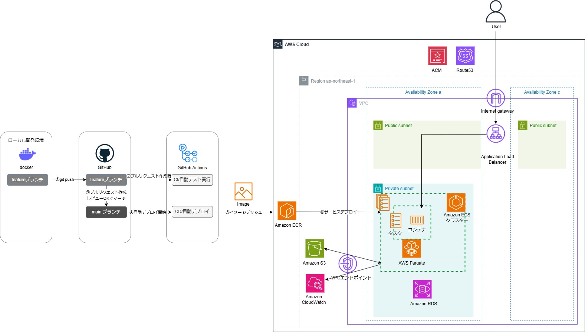

## 5.ER図
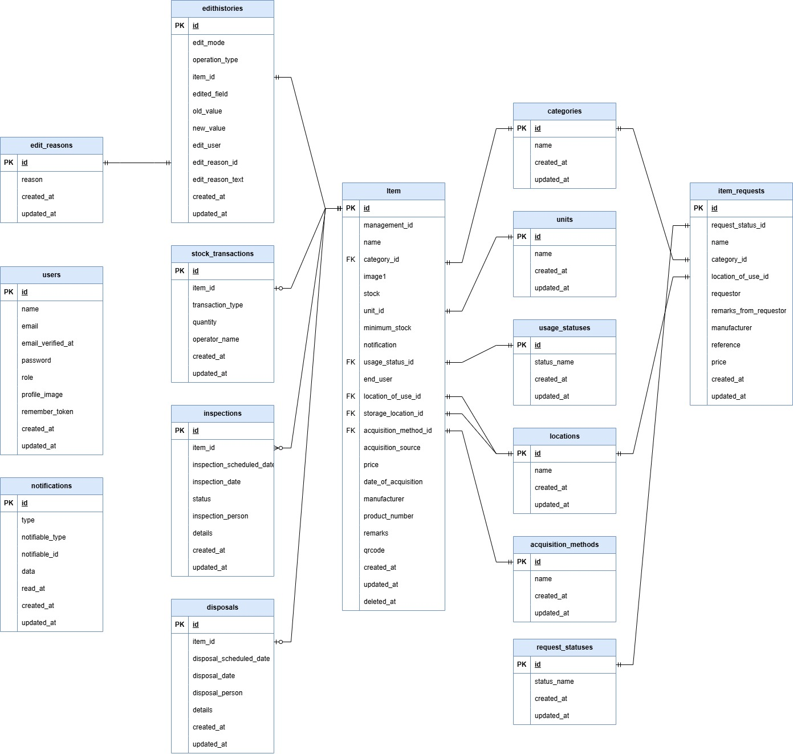


## 6.アプリの特徴
コンセプトは「**管理者だけでなく従業員も参加できる備品管理システム**」です。

管理者と従業員の権限を設けることで、管理者だけでなく従業員も備品管理に参加できる仕組みを作りました。  
以下は管理者権限での画面と従業員権限での画面になります。

### 管理者権限での画面(すべての機能)
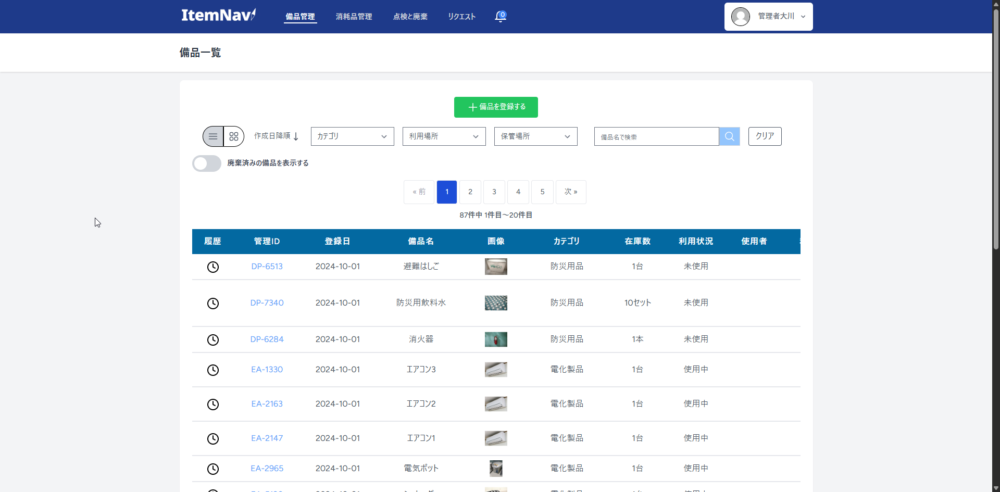

### 従業員権限での画面(限定的な機能)


## 7.アプリの主な機能一覧

| 機能         | 管理者 | 従業員 |
|--------------|--------|--------|
| ①備品登録・編集    | 　○   |       |
| ②備品編集履歴表示 | 　○   |       |
| ③備品の点検・廃棄   | 　○   |       |
| ④消耗品入出庫（QRコード読取対応） | 　○   |   　○  　 |
| ⑤消耗品在庫履歴表示 | 　○   |   　○  　 |
| ⑥QRコードPDFダウンロード | 　○   |   　○  　 |
| ⑦点検と廃棄の予定・履歴の表示 | 　○   |       |
| ⑧備品のリクエスト作成 | 　○   |   　○  　 |
| ⑨備品のリクエスト評価機能 | 　○   |       |
| ⑩通知機能（3種類の通知） | 　○   |       |
| ⑪ダッシュボード表示 | 　○   |       |

##### ※「Google Chrome」でのみ、動作確認しています

### ゲストログイン
ログイン画面からのゲストログインでパスワードの入力なしにログインできますので、是非操作していただけますと幸いです。  
（※ゲストログインではデータ保存処理は行うことが出来ません、DBへの保存処理を伴う機能をお試しになりたい場合は、お送りいたしますユーザー名とパスワードでログインいただければ幸いです。）
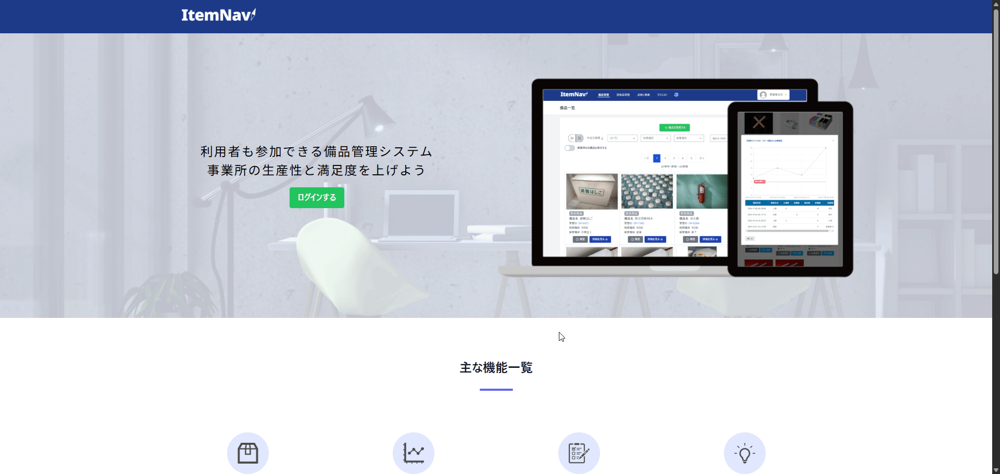


### ①備品登録・編集


### ②備品編集履歴表示
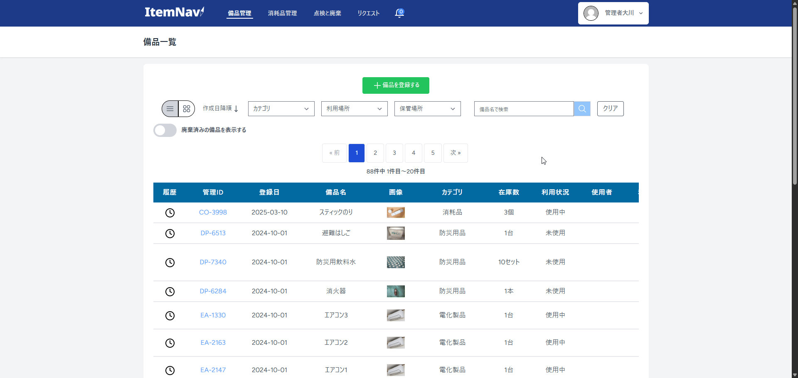

### ③備品の点検・廃棄
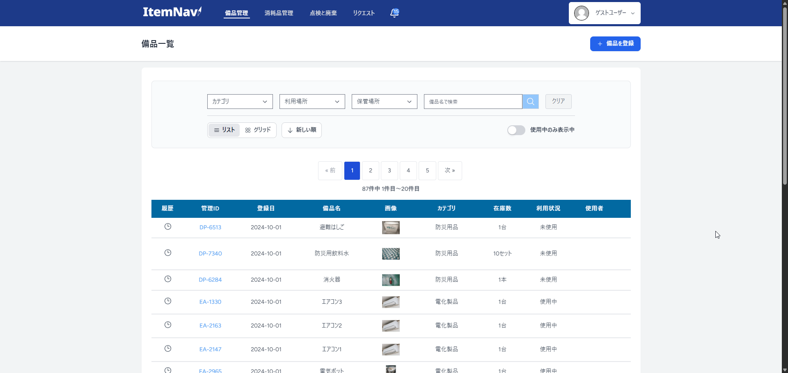

### 備品の復元
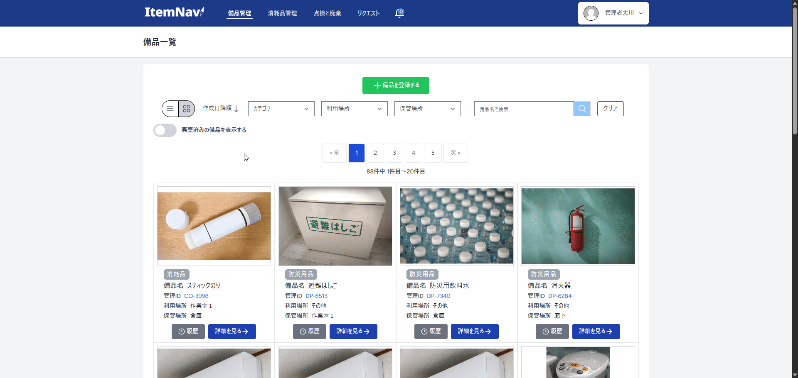

### ④点検・廃棄の予定と履歴の表示


### ⑤消耗品入出庫（QRコード読取対応）
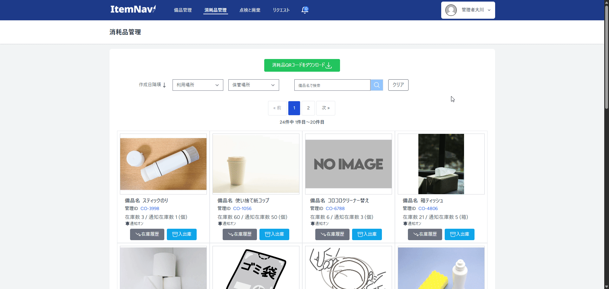

### 従業員による消耗品の入出庫処理画面
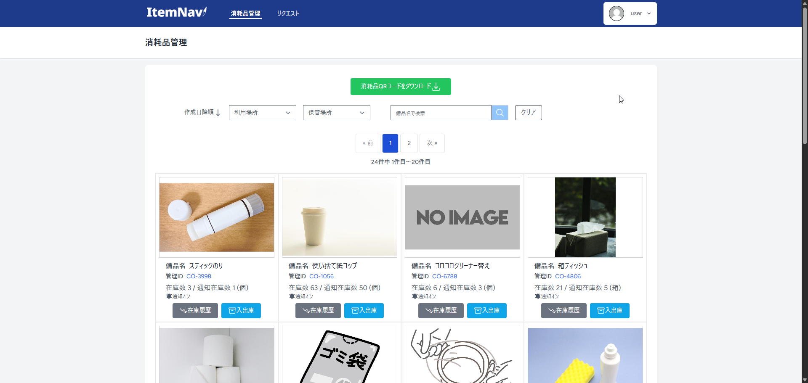

### スマホ・タブレットでのQRコード読み取りで、入出庫のモーダルウィンドウを開く
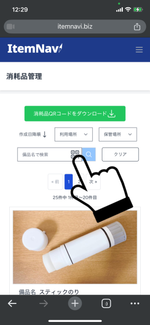

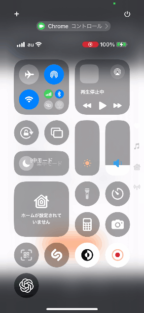


### ⑥消耗品在庫履歴表示
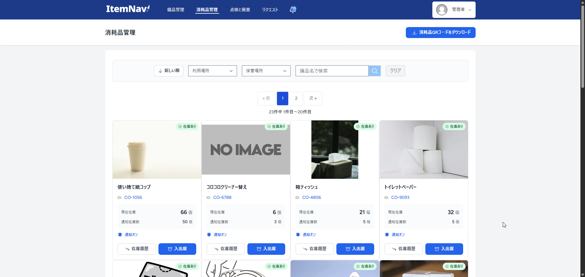

### ⑦QRコードPDFダウンロード


### ⑧備品のリクエスト作成
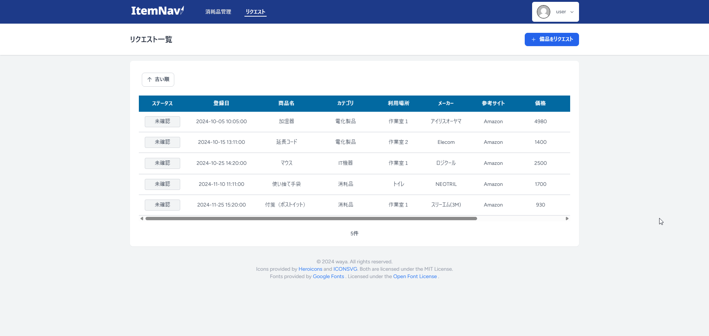

### ⑨備品のリクエスト評価機能
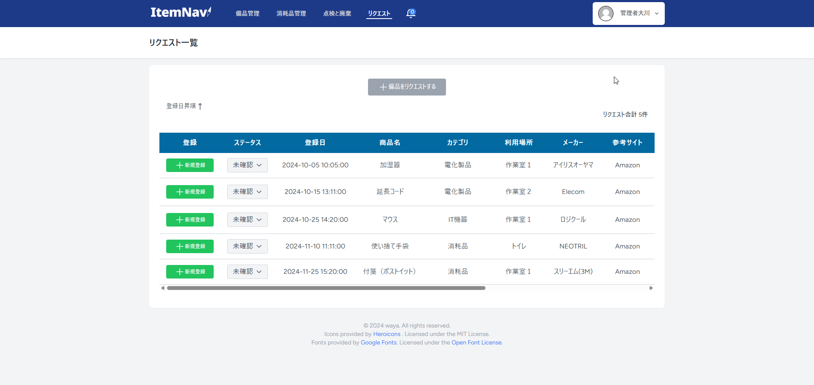

### ⑩通知機能（3種類の通知）


### ⑪ダッシュボード表示 


## 8.今後実装予定の機能
- 棚卸機能の追加
- 管理者によるユーザー発行機能の追加


## 9.ローカル環境でアプリを動かす方法（Windows環境の場合）

**必要環境**   
自分の環境がWindowsなので、Windowsでの環境構築を想定しています。  
以下のインストールを事前に行います。
- WSLをインストールする
- Docker Desktopをインストールする
- VScodeで拡張機能のRemote Developmentをインストール（VScode上でWSLにアクセス可能）


**DockerDesktopの起動**  
リポジトリのクローンの前にDockerDesktopを起動しておきます。

**リポジトリのクローン**  
VScodeで「Ctrl + Shift + P」で「WSLへ接続」と入力して、WSL上にアクセスします。
任意の場所でgit cloneします。
```
git clone https://github.com/waya-kkazuya/EMS.git
cd EMS
```

**.envファイルの準備**  
.env.exampleをコピーして.envを作成します。
```
cp .env.example .env
```

**依存関係をインストール**  
Sailを含む依存関係をインストールします。
```
composer install
```

**Sailを使えるようにする**  
Sailの実行スクリプトをインストールします。
選択肢が表示された場合は、mysqlを選択します。
```
php artisan sail:install
```

**Dockerコンテナを起動**  
Sailを使用してLaravel環境を立ち上げます。
```
./vendor/bin/sail up -d
```

**Laravelのセットアップ**  
アプリケーションキーの生成と、データベースにテストデータを入れます。
```
./vendor/bin/sail artisan key:generate
./vendor/bin/sail artisan migrate --seed
```

**フロント側の依存関係をインストール**  
※この時「./vendor/bin/sail」を付けずに、「npm install」とだけコマンドを打つと、WSL上ではなくWindows上を参照し、依存関係のインストールが上手くいかないので注意が必要です。
```
./vendor/bin/sail npm install
```

**Viteの起動**  
フロントエンドの開発サーバーを立ち上げます。
```
./vendor/bin/sail npm run dev
```

**アプリを開く**  
以下のURLで開発の画面を確認します。
```
http://localhost:8000
```


## おわりに
ここまで見ていただきありがとうございます。  
私の学習の成果としてリポジトリを公開させていただきました。

アプリ作成についてのを[Qiita記事](https://qiita.com/waya_k/private/b0f373dbec4719210335)を投稿しているので、ご覧いただけますと幸いです（Qiita記事には、アプリ自体のご紹介のほか、作成における自身の考えなどもまとめてあります）。

## 開発者
- waya
- Xアカウント: https://x.com/8zBA40yLA6Hpgrl