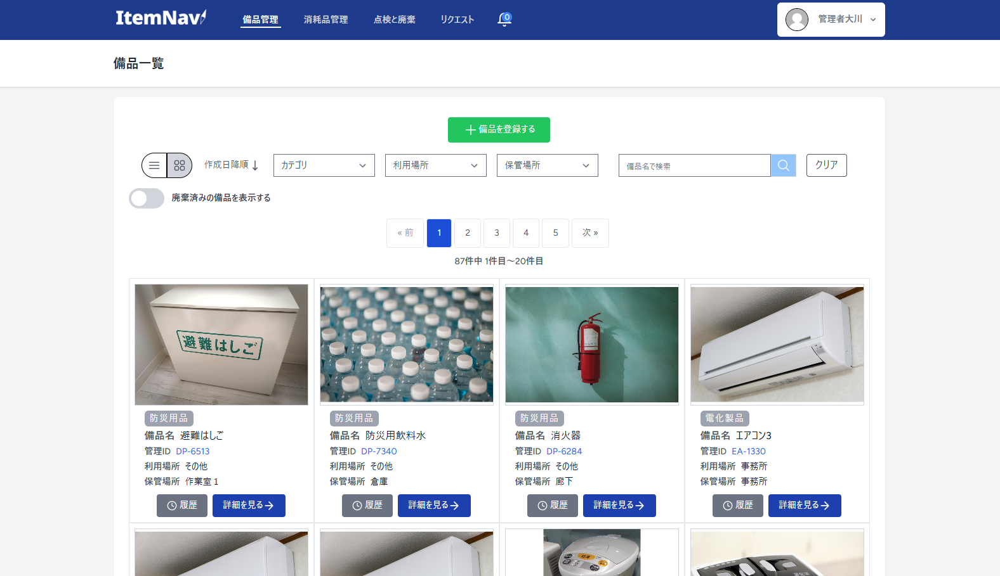

# 備品管理システム「ItemNavi」

## 1. はじめに
- 本リポジトリは「waya」(Xアカウント: @8zBA40yLA6Hpgrl)が作成した備品管理システム「ItemNavi」に関するものです
- ご利用いただくことでのトラブル等は一切責任を置いかねます

## 2. コンセプト
- 備品を管理する側だけでなく、利用する側も参加できる備品管理システムです  
  私が以前働いていた事業所で感じていた下記の問題を解消し、生産性と満足度を向上することを目指しました  

  - 必要な時に手元に必要な消耗品の在庫がない
  - 従業員が業務に必要だと感じる備品を上司に伝えても、その後音沙汰がない

  アプリ作成についての記事はQiitaに投稿していますので、ご覧いただけますと幸いです。
  （Qiita記事には、～～～）

## アプリ概要
- 備品管理機能
- 消耗品管理機能
- 点検・廃棄機能
- 備品リクエスト作成機能
- 通知機能

## デモ動画
１分以内の動画
一連の動作がわかるように

- PC画面の動画
- スマホのカメラを使ったQRコード読み取り機能のデモ

## システム画面

## 機能一覧
- 備品登録
- 備品編集
- 備品編集履歴表示
- 消耗品入出庫機能
- QRコードラベルをPDFでダウンロードする機能(PDF生成ライブラリs)
- QRコード読取機能(Vue-Qrcode-ReaderS)
- 消耗品入出庫履歴表示(Vue-Chart)
- 備品点検・廃棄機能
- 通知機能
- 備品リクエスト機能
- プロフィール編集機能

## 使用技術
- **フロントエンド**
  - HTML
  - CSS
  - TailwindCSS 3.2.1
  - TypeScript 5.6.3
  - Vue.js 3.4.29
  - inertiajs/vue3 1.0.0

- **バックエンド**
  - PHP 8.2.26
  - Laravel 10.0
  - inertiajs/inertia-laravel 0.6.8
  - PHPUnit 10.0

- **インフラ**
  - Docker 27.4.0 (開発環境)
  - AWS(ECS, Fargate, ECR, ALB, ACM, Route53, S3, RDS, CloudWatch, VPC, IAM)

- **CI/CD**
  - GitHub Actions(コードカバレッジ: 76%)

- **開発環境**
  - Visual Studio Code
  - Git 2.34.1/GitHub
  - Apache
  - phpMyAdmin

## ER図

## AWS構成図

## 利用方法
どのようにして使うか
インストール方法

GitHubからgit cloneしてきて、docker上で動かす手順
※Docker必須、自分でも試してみる

## 実装予定の機能
今後の計画
- 棚卸機能

## おわりに
ここまで見ていただきありがとうございます
私の学習の成果としてリポジトリを公開させていただきました

このアプリを作成したときの考えは、別にQiita記事にまとめありますので、よければそちらもご参照ください
Qiita記事リンク

##　ライセンス情報
Heroicons
Google Fonts

## 開発者
- waya
- Xアカウント:
